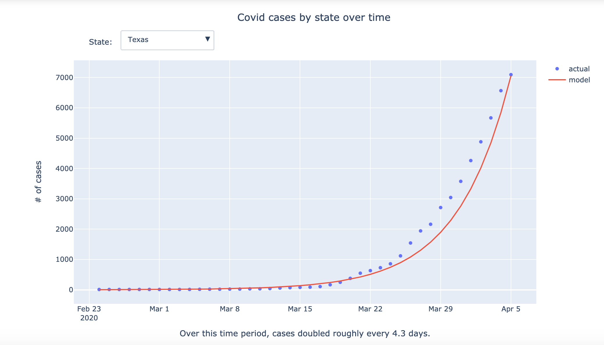
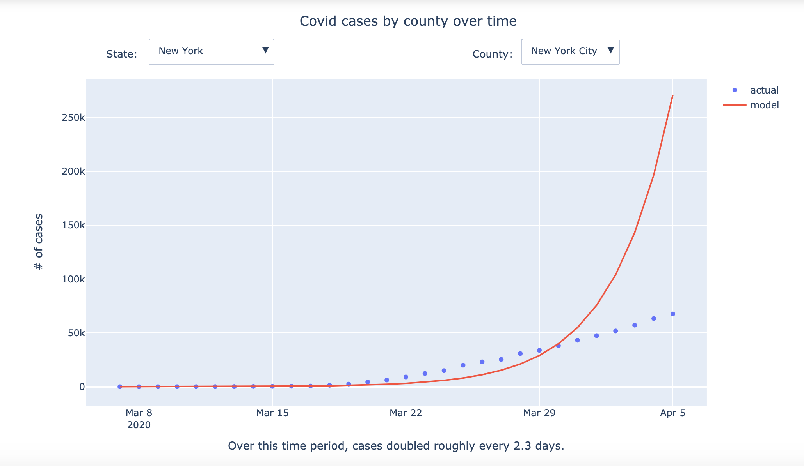
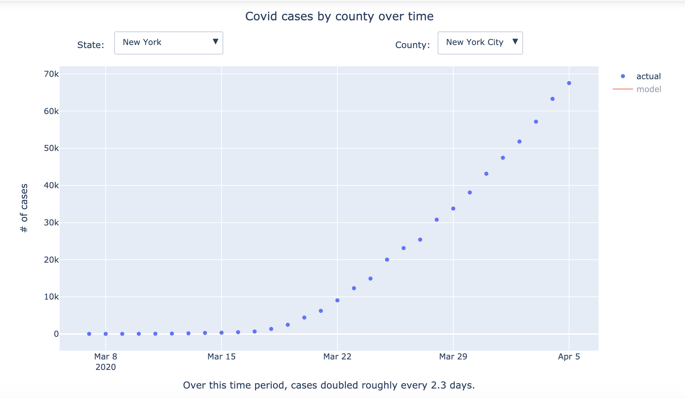

# Visualizing US Covid trends by State/County

There are many great visualizations that show the current number of Covid-19 cases in each US county
(e.g. [John’s Hopkins](https://coronavirus.jhu.edu/map.html), [NY Times](https://www.nytimes.com/interactive/2020/us/coronavirus-us-cases.html)).
But none that I could find show the trend over time in each region.

This project plots the number of cases over time broken down at the US county level and at the state level.

<b>[Click here to view the plots.](https://nbviewer.jupyter.org/github/amurthy1/coviz/blob/master/coviz.ipynb)</b>

## Better Understanding the Data

- Data was taken from the [NY times dataset](https://github.com/nytimes/covid-19-data).
More details on how the data was collected can be found in the README for that repo.

- Counties with fewer than 3 days of 10+ cases were excluded.

- The data is plotted with a fitted exponential curve, which is how pandemics are expected to evolve in the initial stages.
The data in Texas closely follows this pattern, with case numbers doubling at a consistent frequency.



- The data in New York City has a different shape.
The fitted exponential predicts a much higher value compared to the actual value on the most recent day.
This indicates the rate of doubling is slowing over time.



- To view the data without the fitted curve, click “model” in the legend on the right.



## Running the notebook locally

This project was done in Python3 and depends on the plotly and pandas packages. You can install them using the following:

```
pip install pandas
pip install plotly
```

Once you’ve done that, you should be able to clone the repo, make desired changes, and run the notebook on your local machine.

## Ideas for Improvement

- Currently the plot is a static html with whatever data it had when the repo was last pushed.
A smarter hosting solution could have the data + plots dynamically update when new data is available.
- Add options to toggle date range and log scale for the charts.
- Add other data besides number of cases (e.g. mortality rate, ratio of tests coming back positive, etc.)
